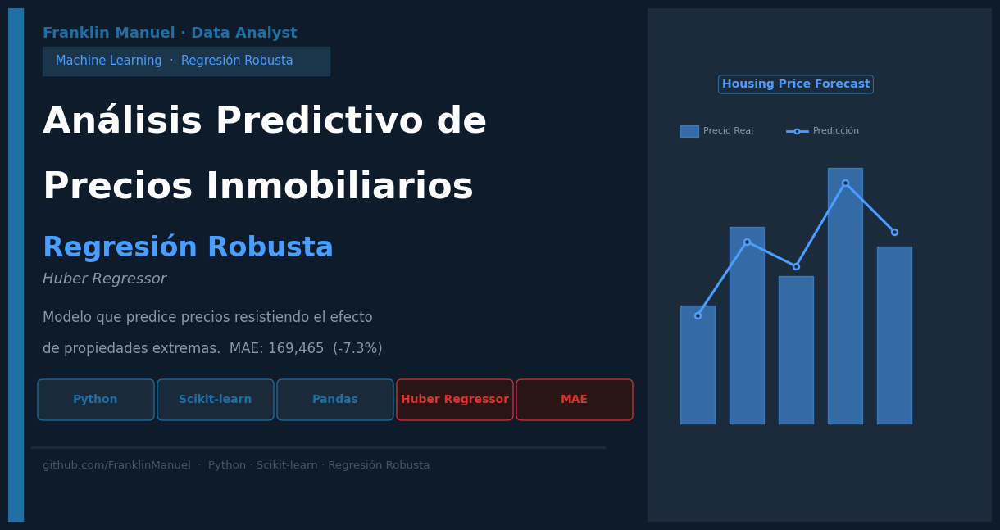

# Análisis Predictivo de Precios Inmobiliarios



> Implementación de modelos de regresión robusta para predicción de precios inmobiliarios, diseñada para mitigar el impacto de valores atípicos (outliers) sin perder interpretabilidad.

---

## Resultado

| Modelo | MAE | Mejora |
|---|---|---|
| Regresión Lineal | 182,847 | — |
| HuberRegressor | 169,465 | 7.3% menor error |

El HuberRegressor superó a la regresión lineal clásica reduciendo el error promedio de predicción en un 7.3%.

---

## Tecnologías


| Herramienta | Uso |
|---|---|
| Python 3.x | Lenguaje principal |
| Scikit-learn | Modelos, preprocesamiento y métricas |
| Pandas / NumPy | Manipulación de datos |
| Matplotlib / Seaborn | Visualización |
| SciPy | Análisis estadístico |

---

## Cómo Ejecutar

1. Abre el notebook en Google Colab o Jupyter
2. Carga los archivos `X.csv` y `y.csv` en tu Google Drive
3. Actualiza la ruta en las celdas de carga
4. Ejecuta todas las celdas en orden

```bash
pip install scikit-learn pandas numpy matplotlib seaborn scipy
```

---

## Tabla de Contenidos

- [1. Identificación del Problema](#1-identificación-del-problema)
- [2. Los Datos — Cómo se utilizan para resolver el problema](#2-los-datos--cómo-se-utilizan-para-resolver-el-problema)
- [3. Conclusiones Finales](#3-conclusiones-finales)

---

## 1. Identificación del Problema

### ## Objetivo del Proyecto

Comprar o vender una propiedad sin información precisa sobre su valor real es un problema costoso. Para un comprador, significa pagar de más. Para una inmobiliaria, significa perder dinero o clientes. Para un banco que otorga hipotecas, significa asumir riesgos mal calculados.

La pregunta que resuelve este proyecto es directa:

**¿Podemos predecir el precio de una propiedad a partir de sus características físicas y de ubicación?**

### Desafíos Técnicos

Los precios inmobiliarios no se distribuyen de forma uniforme. Existen propiedades con precios extremadamente altos que distorsionan los modelos tradicionales — un penthouse de lujo en el mismo dataset que un apartamento estudio puede arruinar las predicciones si no se maneja correctamente.

Este fenómeno se llama **valores atípicos (outliers)** y es el principal reto técnico del proyecto.

### Solución Propuesta

Evaluar y comparar dos modelos de regresión:

- **Regresión Lineal** — modelo clásico, sensible a los outliers
- **HuberRegressor** — modelo robusto, diseñado para resistir el efecto de precios extremos

> **Ejemplo concreto:** Imagina 100 apartamentos y 2 mansiones de lujo en el mismo dataset. Un modelo común intenta ajustarse a todos incluyendo las mansiones, y falla en los apartamentos normales. El HuberRegressor le da menos peso a esas mansiones y predice mejor el resto.

---

## 2. Los Datos — Cómo se utilizan para resolver el problema

### ¿Qué datos se usan?

| Archivo | Contenido |
|---|---|
| `X.csv` | Variables independientes — características de cada propiedad |
| `y.csv` | Variable objetivo — precio de cada propiedad |

### Variables principales

| Variable | Tipo | Descripción |
|---|---|---|
| `property_type` | Categórica | Tipo de propiedad (apartamento, casa, etc.) |
| `approximate_latitude / longitude` | Numérica | Ubicación geográfica |
| `has_a_garage` | Booleana | Si tiene garaje |
| `has_a_balcony` | Booleana | Si tiene balcón |
| `has_air_conditioning` | Booleana | Si tiene aire acondicionado |
| `price` | Numérica | Precio de la propiedad (variable a predecir) |

### Preprocesamiento de Datos

**1. Eliminación de columnas con muchos valores faltantes**
Columnas como `exposition` (75% nulos) o `energy_performance_category` (49% nulos) se eliminan porque no aportan información confiable.

**2. Reducción de cardinalidad con regla de Pareto (99%)**
La variable `property_type` tiene miles de categorías. Se conservan solo las que representan el 99% de los datos.

> **¿Qué es cardinalidad?** La cantidad de valores únicos que tiene una variable. Alta cardinalidad significa demasiadas categorías distintas, lo cual dificulta el aprendizaje del modelo.

**3. Codificación One-Hot**
Las variables categóricas fueron transformadas mediante One-Hot Encoding.

> Se aplicó reducción de cardinalidad mediante regla de Pareto (99%) para disminuir sparsity y mejorar estabilidad del modelo.

**4. Estandarización**
Todas las variables numéricas se transforman para tener media 0 y desviación estándar 1, evitando que variables con valores grandes dominen el modelo.

### Flujo del proyecto (pipeline)

> **Pipeline** es la secuencia ordenada de pasos que siguen los datos desde que entran hasta que se obtiene el resultado final. Como una línea de producción: cada etapa transforma los datos y los pasa a la siguiente.

```
1. Carga de datos (X.csv + y.csv)
        ↓
2. Limpieza — eliminación de columnas con alta nulidad
        ↓
3. Reducción de cardinalidad (Pareto 99%)
        ↓
4. One-Hot Encoding de variables categóricas
        ↓
5. Estandarización (media 0, std 1)
        ↓
6. División entrenamiento / prueba (75% / 25%)
        ↓
7. Entrenamiento: Regresión Lineal vs HuberRegressor
        ↓
8. Evaluación con MAE (Error Absoluto Medio)
        ↓
9. Análisis de coeficientes — variables más influyentes
```

### Métrica de Evaluación

Se usa el **MAE (Mean Absolute Error)**: el promedio de cuánto se equivoca el modelo al predecir el precio.

$$\text{MAE} = \frac{1}{n} \sum_{i=1}^{n} \left| y_i - \hat{y}_i \right|$$

- Cuanto más bajo el MAE, mejor predice el modelo
- MAE = 169,465 → el modelo se equivoca en promedio en ese valor al predecir el precio

---

## 3. Conclusiones Finales

### Comparación de Modelos
El **HuberRegressor redujo el error en un 7.3%** respecto a la regresión lineal, sin sacrificar interpretabilidad. Es más adecuado cuando los datos tienen precios extremos — como ocurre siempre en el mercado inmobiliario real.

### Variables Más Influyentes

- Las variables de **ubicación geográfica** tienen alta influencia
- El tipo de propiedad `viager` tiene el coeficiente más negativo — reduce significativamente el precio predicho
- Garaje, balcón y aire acondicionado tienen influencia positiva

### Limitaciones del Modelo

- El modelo no captura relaciones no lineales entre variables y precio
- El umbral de Huber fue fijado manualmente; optimización de hiperparámetros podría mejorar resultados
- Variables con alta nulidad debieron descartarse, reduciendo información disponible

### Trabajo Futuro

Probar modelos no lineales como Random Forest o XGBoost, aplicar optimización de hiperparámetros y enriquecer el dataset con variables de contexto como cercanía a servicios.


## Habilidades Demostradas

- Modelado estadístico
- Regresión robusta
- Machine Learning supervisado
- Feature Engineering
- Tratamiento de outliers
- Preprocesamiento de datos
- Estandarización y codificación
- Evaluación de modelos
- Interpretabilidad de modelos
- Python / Scikit-learn

---

## Autor

Proyecto desarrollado como parte de un curso de **Machine Learning & AI**.
