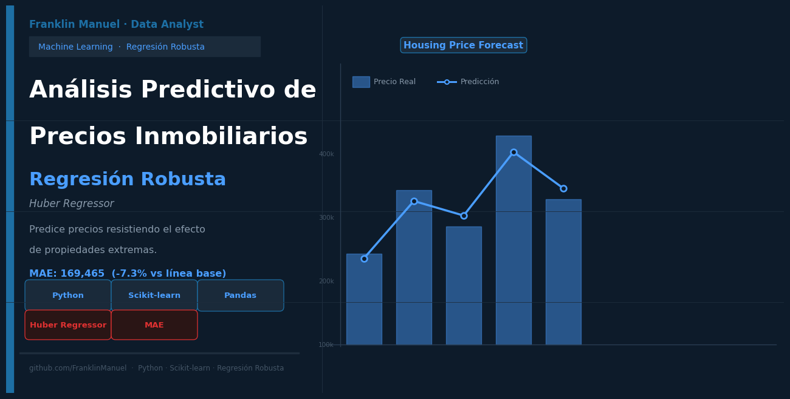

# Modelado de Regresión Robusta y Machine Learning para la Predicción de Precios Inmobiliarios (PropTech)

> Implementación de un pipeline de punta a punta (end-to-end) en Python para optimizar la tasación automatizada de activos residenciales, mitigando el impacto de valores atípicos mediante algoritmos de regresión robusta sin perder la interpretabilidad comercial de las variables.

---

## 1. Resumen Ejecutivo (Executive Summary)

* **Impacto Cuantificado ("Wow" Result):** La implementación del modelo robusto `HuberRegressor` superó la regresión lineal tradicional, logrando una **reducción del 7.3% en el error de predicción**, disminuyendo el Error Absoluto Medio (MAE) de 182,847 USD a **169,465 USD**.
* **El Problema:** El mercado inmobiliario real presenta una alta volatilidad y precios extremos (penthouses y mansiones) que actúan como valores atípicos (*outliers*), distorsionando por completo los modelos estadísticos clásicos y provocando valoraciones erróneas.
* **La Solución:** Se construyó un pipeline de Machine Learning automatizado que ejecuta limpieza de datos masivos, ingeniería de variables basada en la regla de Pareto (99%) y estandarización para entrenar un modelo robusto que penaliza las desviaciones extremas.
* **Próximos Pasos:** Desarrollar modelos no lineales basados en árboles (*Tree-based models*) y enriquecer el dataset con variables de contexto urbano para cerrar aún más la brecha del error.

---

## 2. Definición del Problema de Negocio (Business Problem)

En el sector inmobiliario y de tecnología de la propiedad (*PropTech*), estimar incorrectamente el valor de un inmueble conlleva pérdidas financieras críticas para los tres actores principales del ecosistema:
1. **Agencias e Inmobiliarias:** Un precio inflado estanca el activo en el mercado y destruye la confianza del cliente; un precio rezagado significa regalar el margen de ganancia neta.
2. **Compradores e Inversores:** Se enfrentan a la asimetría de información, asumiendo el riesgo de pagar un sobreprecio injustificado que compromete su retorno de inversión.
3. **Entidades Financieras (Bancos):** Necesitan calcular con total precisión el valor de las garantías que respaldan los créditos hipotecarios para mitigar el riesgo de impago.

Este proyecto resuelve de forma directa la pregunta comercial central: **¿Podemos predecir el valor real de mercado de una propiedad a partir exclusivamente de sus dimensiones físicas y su ubicación geográfica?** Al abordar este problema, demostramos que no solo analizamos código, sino que protegemos el capital de la organización mediante decisiones respaldadas por datos.

---

## 3. Metodología End-to-End y Habilidades Técnicas (Methodology & Skills)

Para garantizar que el modelo sea escalable y libre de sobreajuste (*overfitting*), los datos (37,368 registros) se procesaron secuencialmente mediante un flujo de producción estricto:

1. **Limpieza Avanzada y Gestión de Nulidad:** Diagnóstico automatizado de la calidad de la información. Se descartaron columnas con ruido estructural o vacíos de información masivos que habrían sesgado el aprendizaje: `exposition` (75.66% nulos), `floor` (74% nulos), `land_size` (58% nulos), `ghg_category` (50% nulos) y variables de eficiencia energética (48.97% nulos).
2. **Ingeniería de Variables (Feature Engineering):**
   * *Filtro de Pareto al 99%:* La variable categórica `property_type` presentaba miles de variantes de baja frecuencia (alta cardinalidad). Se aplicó una regla de Pareto para conservar únicamente las categorías que acumulan el 99% de los datos, reduciendo drásticamente la dispersión (*sparsity*).
   * *Codificación One-Hot Encoding:* Transformación de variables cualitativas remanentes a columnas binarias mediante `pd.get_dummies()`.
   * *Estandarización Estadística:* Uso de `StandardScaler` en variables numéricas para escalar sus valores a media 0 y desviación estándar 1, asegurando estabilidad numérica en los algoritmos lineales.
3. **Validación Cruzada:** División estricta del dataset en conjuntos de entrenamiento (75%) y prueba (25%).
4. **Modelado Comparativo:** Evaluación paralela de un modelo clásico (`LinearRegression`) frente a uno robusto (`HuberRegressor`), utilizando funciones de Scipy para analizar asimetrías y curtosis estadísticas en los residuos de los precios.

**Habilidades Clave Demostradas:** Machine Learning Supervisado, Regresión Robusta, Tratamiento de Outliers, Feature Engineering, Estandarización de Variables, Validación Cruzada y Evaluación de Métricas de Error.

---

## 4. Resultados y Métricas de Evaluación (Results)

La métrica principal seleccionada para medir el rendimiento fue el **Error Absoluto Medio (MAE)**. Se prefirió sobre otras métricas debido a que expresa el error promedio directamente en unidades monetarias (USD), permitiendo una traducción directa del desempeño matemático al lenguaje del negocio.

| Modelo Evaluado | MAE (Error Promedio) | Comportamiento frente a Outliers |
|---|---|---|
| Regresión Lineal Clásica | 182,847 USD | Vulnerable; las propiedades de lujo arrastran la línea de tendencia distorsionando la predicción común. |
| **HuberRegressor (Elegido)** | **169,465 USD** | **Robusto; ignora el peso desproporcionado de los valores extremos, reduciendo el error un 7.3%**. |

---

## 5. Análisis de Coeficientes y Recomendaciones Estratégicas (Business Recommendations)

Más allá de las métricas, los coeficientes del modelo `HuberRegressor` actúan como un motor de insights comerciales para la toma de decisiones de inversión o desarrollo inmobiliario:

* **El Factor del Tipo de Propiedad:**
  * El coeficiente de `property_type_maison` es de **-27,264 USD**. Esto indica que, manteniendo constantes el resto de las variables (ubicación y tamaño), las casas valen en promedio 27k USD menos que la categoría base de apartamentos (`appartement`). 
  * *Recomendación de Negocio:* Las estrategias de adquisición de la compañía deben priorizar la compra y remodelación de apartamentos en zonas urbanas, dado que el mercado castiga el formato de casa tradicional frente al apartamento vertical en este dataset. Categorías especiales como `viager` (-10,671 USD) requieren un descuento preestablecido en los algoritmos de compra debido a sus restricciones legales intrínsecas.
* **El Impacto Contra-intuitivo de los Garajes (`nb_boxes`):**
  * Cada plaza de garaje cerrada adicional **reduce el precio predicho en -2,052 USD**. 
  * *Insight de Negocio:* Esto sugiere que en los centros urbanos densos, el costo de mantenimiento asociado a los espacios de estacionamiento cerrados no es valorado por el comprador, o bien estas plazas están correlacionadas con ubicaciones rurales con menor plusvalía.
  * *Recomendación de Negocio:* Detener la sobreevaluación o construcción masiva de garajes adicionales si el objetivo del proyecto es maximizar el valor de reventa inmediato.
* **Atributos que Elevan la Plusvalía:**
  * El incremento en el número de habitaciones (`nb_rooms`) junto con comodidades específicas como terrazas, balcones y aire acondicionado arrojaron pesos positivos determinantes en la ecuación.
  * *Recomendación de Negocio:* Dirigir los presupuestos de remodelación física (*flipping*) exclusivamente a la apertura de espacios exteriores (balcón/terraza) y a la instalación de aire acondicionado, garantizando el mayor retorno de inversión (ROI) directo sobre el valor final de venta.

---

## 6. Limitaciones del Proyecto y Próximos Pasos (Limitations & Next Steps)

Para mantener un enfoque de mejora continua y transparencia en la ingeniería de datos, se han mapeado las limitaciones actuales y las oportunidades de expansión a largo plazo:

* **Limitaciones Detectadas:** Al ser un enfoque basado en coeficientes lineales, el modelo asume relaciones directas y uniformes, perdiendo de vista posibles interacciones complejas no lineales entre el tamaño de la propiedad y ciertas ubicaciones exclusivas. Adicionalmente, el umbral de Huber se configuró manualmente y la alta nulidad de variables críticas como la categoría de rendimiento energético redujo el volumen de datos útiles para el análisis.
* **Trabajo Futuro (Cherry on Top):**
  1. *Modelado No Lineal:* Implementar y comparar algoritmos basados en ensambles de árboles de decisión como `RandomForestRegressor` y `XGBoost` para capturar interacciones complejas de variables.
  2. *Optimización de Hiperparámetros:* Ejecutar búsquedas sistemáticas (`GridSearchCV` / `RandomizedSearchCV`) para sintonizar científicamente el parámetro épsilon del regresor robusto.
  3. *Enriquecimiento de Datos Geográficos:* Integrar APIs de geolocalización externa para calcular distancias a puntos de interés (estaciones de transporte, escuelas de alto nivel, hospitales y centros comerciales), variables determinantes en el valor real del suelo.

---

### Tecnologías Utilizadas
* Python 3.x, Scikit-learn, Pandas, NumPy, Matplotlib, Seaborn, SciPy.

### Autor
* **Franklin Manjarres**
* ✉️ [manjarresfranklin587@gmail.com](mailto:manjarresfranklin587@gmail.com)
* 💼 [LinkedIn](https://www.linkedin.com/in/franklinmanjarres/)

*Proyecto desarrollado con enfoque metodológico comercial enfocado en soluciones de Machine Learning aplicadas a problemas PropTech.*

